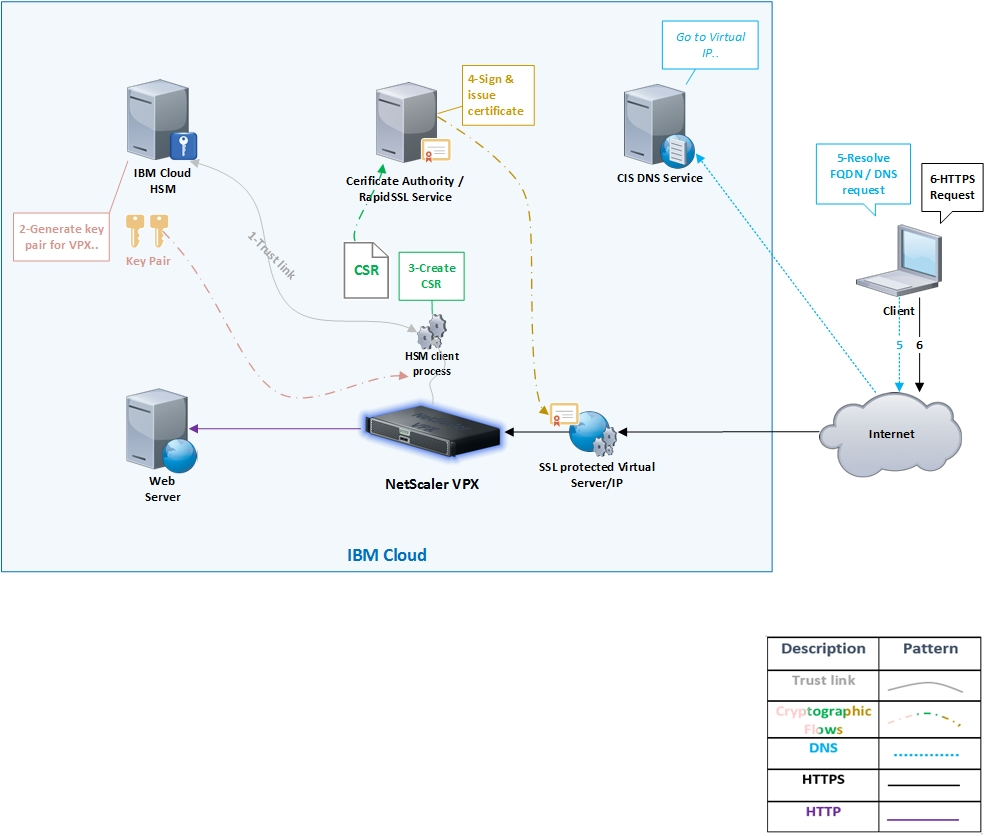

---

copyright:
  years: 2018, 2019
lastupdated: "2019-11-12"

keywords:

subcollection: citrix-netscaler-vpx

---

{{site.data.keyword.attribute-definition-list}}

# Deploying and configuring the IBM Hardware Security Module (HSM) with Citrix Netscaler VPX
{: #deploying-and-configuring-the-ibm-hardware-security-module-hsm-with-citrix-netscaler-vpx}

This step-by-step guides you through integrating the HSM with {{site.data.keyword.vpx_full}}. The two services can then communicate and generate the cryptographic material required to create a certificate.
{: shortdesc}

## About the deployment
{: #about-hsm}

This deployment was built and tested with the following component specifications:

| NetScaler VPX Version & Build	| HSM Software Version | HSM Firmware version | HSM Client Version |
| ------------- | ------------- | ------------- | ------------- |
| NS12.1: Build 48.13.nc | 6.2.2-5 | 6.10.9 | 6.2.2 |
{: caption="Component specifications" caption-side="bottom"}

If you have an older version of VPX or, if when ordering the device through the {{site.data.keyword.cloud}} platform you only see versions 11.1 and earlier as selection options, the device can be upgraded so that the set-up described in this guide can be completed.
{: note}

## Logical topology
{: #topology-local}

The following diagram shows the network traffic flow for the SSL offload use case. This provides a visual and logical perspective of the trust link and the configuration between VPX and the HSM appliance.

{: caption="Network flows topology" caption-side="bottom"}

If you are not familiar with SSL offload, review this [Citrix article](https://docs.citrix.com/en-us/netscaler/12-1/ssl.html).

## What you'll accomplish
{: #what-you-accomplish}

In this step-by-step guide you will learn how to deploy and configure an HSM with a {{site.data.keyword.vpx_full}}:

Task  | Description
------------- | -------------
[Order a Hardware Security Module (HSM)](/docs/citrix-netscaler-vpx?topic=citrix-netscaler-vpx-order-the-ibm-hardware-security-module-hsm-) | First, you'll order an HSM.
[Order a {{site.data.keyword.vpx_full}}](/docs/citrix-netscaler-vpx?topic=citrix-netscaler-vpx-order-a-citrix-netscaler-vpx) | If you haven't already, you'll order a {{site.data.keyword.vpx_full}}.
[Initialize the HSM](/docs/citrix-netscaler-vpx?topic=citrix-netscaler-vpx-initialize-ibm-hardware-security-module-hsm-) | Most configurations require initialization of the HSM device. Without this, only certain `show` commands can be executed.
[Create a partition](/docs/citrix-netscaler-vpx?topic=citrix-netscaler-vpx-create-a-partition) | A partition is a logical and independent space that is associated or attached to the client requesting or creating cryptographic objects in the HSM engine.
[Install the HSM client software](/docs/citrix-netscaler-vpx?topic=citrix-netscaler-vpx-install-the-ibm-hardware-security-module-hsm-client-software) | In this sub-section, VPX is installed with the software and utilities required to interact with the HSM. |
[Establish the Network Trust Link (NTL)](/docs/citrix-netscaler-vpx?topic=citrix-netscaler-vpx-establish-a-network-trust-link-ntl-) | A Network Trust Link (NTL) is a secure channel for the Hardware Security Module (HSM) and the client to communicate. |
[Create keys and generate the Certificate Signing Request (CSR)](/docs/citrix-netscaler-vpx?topic=citrix-netscaler-vpx-create-keys-and-generate-the-certificate-signing-request-csr-) | In this sub-section you'll create a key pair that will be used to generate a Certificate Signing Request (CSR) and order / request a certificate with it. |
[Order the certificate](/docs/citrix-netscaler-vpx?topic=citrix-netscaler-vpx-order-an-ssl-certificate) | Order an SSL certificate for your {{site.data.keyword.vpx_full}}.
[Retrieve and transfer the certificate](/docs/citrix-netscaler-vpx?topic=citrix-netscaler-vpx-retrieve-and-transfer-the-certificate) | Retrieve the SSL certificate ordered earlier and leave everything ready for its installation and configuration in the next step-by-step guide.
